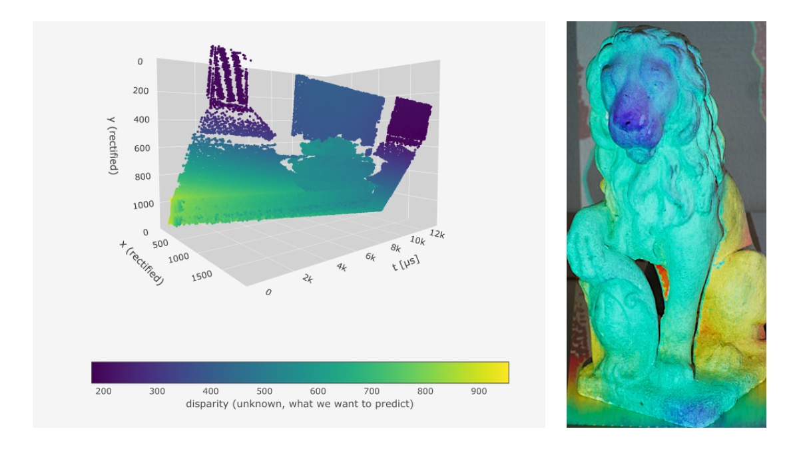
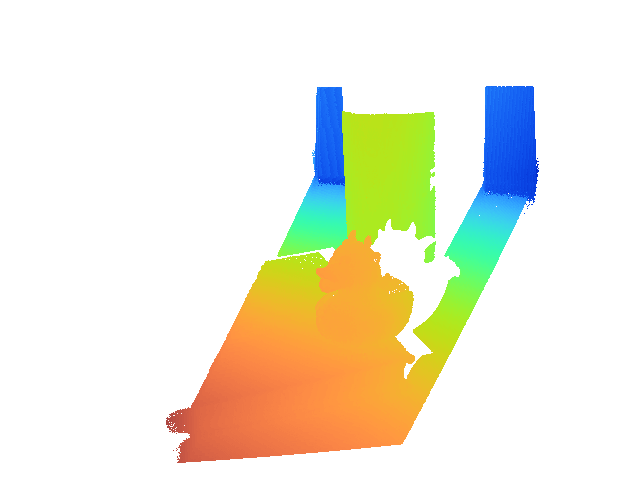

<!-- Improved compatibility of back to top link: See: https://github.com/othneildrew/Best-README-Template/pull/73 -->

<a name="readme-top"></a>

<!-- PROJECT LOGO -->
<br />
<div align="center">
   <h3 align="center">X-maps: Direct Depth Lookup for Event-based Structured Light Systems</h3>
   <br />

  <p align="center">
   
    <!-- <a href="https://github.com/othneildrew/Best-README-Template"><strong>Explore the docs »</strong></a> -->
    <br />
    <br />
    <a href="https://fraunhoferhhi.github.io/X-maps/"><strong>Project Page</strong></a>
    ·
    <a href="https://fraunhoferhhi.github.io/X-maps/paper-html/x-maps-direct-depth-lookup-for-event-based-structured-light-systems.html" target="_blank"><strong>Paper (HTML)</strong></a>
    ·
    <a href="https://openaccess.thecvf.com/content/CVPR2023W/EventVision/papers/Morgenstern_X-Maps_Direct_Depth_Lookup_for_Event-Based_Structured_Light_Systems_CVPRW_2023_paper.pdf" target="_blank"><strong>Paper (PDF)</strong></a>
        ·
    <a href="http://arxiv.org/abs/2402.10061" target="_blank"><strong>arXiv</strong></a>
        ·
    <a href="https://tub-rip.github.io/eventvision2023/papers/2023CVPRW_X-Maps_Direct_Depth_Lookup_for_Event-based_Structured_Light_Systems_poster.pdf" target="_blank"><strong>Poster</strong></a>
    
  </p>

</div>

This project enables you to utilize event cameras to carry out live depth estimations from images projected with a laser projector. We've streamlined the depth estimation process by creating a lookup image with one spatial and one temporal axis (`y` and `t`), forming an X-map. This idea enables speedy depth calculations (taking less than 3 ms per frame), but also maintains the accuracy of depth estimation through disparity search in time maps. The end result is an efficient, reactive tool for designing real-time Spatial Augmented Reality experiences.

The entry point for the live depth estimation is `python/depth_reprojection.py`. The script is using the Metavision SDK to facilitate event data capture from Prophesee cameras. For a straightforward environment setup, an `Ubuntu 20.04` Dockerfile is provided. The depth estimation is implemented in Python with NumPy and Numba.

<!-- ABOUT THE PROJECT -->
<!-- ## About The Project

[![Product Name Screen Shot][product-screenshot]](https://example.com)

There are many great README templates available on GitHub; however, I didn't find one that really suited my needs so I created this enhanced one. I want to create a README template so amazing that it'll be the last one you ever need -- I think this is it.

Here's why:
* Your time should be focused on creating something amazing. A project that solves a problem and helps others
* You shouldn't be doing the same tasks over and over like creating a README from scratch
* You should implement DRY principles to the rest of your life :smile:

Of course, no one template will serve all projects since your needs may be different. So I'll be adding more in the near future. You may also suggest changes by forking this repo and creating a pull request or opening an issue. Thanks to all the people have contributed to expanding this template!

Use the `BLANK_README.md` to get started.

<p align="right">(<a href="#readme-top">back to top</a>)</p>
 -->

## Getting Started

The project is configured to run from a Docker image in Visual Studio Code (VS Code). It was tested on an Ubuntu 22.04 host.

### Installation

1. Clone the repo
   ```sh
   git clone git@github.com:fraunhoferhhi/X-maps.git
   ```
2. Open X-maps folder in VS Code
3. Install the extensions recommended by VS Code (_Docker_ and _Dev Containers_)
4. Copy `.devcontainer/metavision.list.template` to `.devcontainer/metavision.list`
5. Edit `.devcontainer/metavision.list` to fill in the URL to the Ubuntu 20.04 Metavision SDK
6. _Reopen in Container_ in VS Code

<!-- <p align="right">(<a href="#readme-top">back to top</a>)</p> -->

### Download ESL Raw Data for Testing

To use data from the [ESL: Event-based Structured Light](https://rpg.ifi.uzh.ch/esl.html) dataset locally:

1. Create a local folder on the host machine to store the data, e.g. `/data/2022_ESL_Event_based_Structured_Light`.
2. Add a `"mounts"` entry in `devcontainer.json`, that mounts the local folder to `/ESL_data` in the container.
3. _Rebuild container_ to reopen the project with the mounted folder.
4. Terminal &rarr; Run Task... &rarr; _Download ESL (static) raw and bias files_.

### ESL static depth reprojection



_ESL book duck sequence depth estimation, from the camera perspective_

<br />

Run the target _X-maps ESL static seq1_. A window should open that performs a live depth estimation of the `book_duck` sequence, rendered by default from the projector's perspective.

### Live depth reprojection (Spatial Augmented Reality example)

1. Ensure that the camera is working correctly by running `metavision_player` in a Terminal in VS Code.
2. Calibrate your camera-projector setup, and write the parameters into a YAML file, storing the OpenCV matrices. Examples can be found in `data/`.
3. Choose camera biases in a way to produce mostly positive events (negative are ignored in processing) and produce few events outside the projected area.
4. Edit the command line arguments for target _X-maps live depth reprojection_ in `.vscode/launch.json`.
5. Display bright content on the projector to allow the start and end of the frame to be identified (trigger finding).
6. Running _X-maps live depth reprojection_ creates a window that shows the scene depth from the projector's view.
7. Move the depth reprojection window to the projector to overlay the scene with the measured depth.

To display the depth in full screen on the projector, use the OS window manager to maximize the window. On Ubuntu, a keyboard shortcut can be set under Settings &rarr; Keyboard &rarr; View and Customize Shortcuts &rarr; Windows &rarr; Toggle fullscreen mode.

The parameters you can use when running the `depth_reprojection.py` script can be listed by running `python3 python/depth_reprojection.py --help` in a Terminal in the Docker image in VS Code.

| Parameter              | Explanation                                                                                                                                    |
| ---------------------- | ---------------------------------------------------------------------------------------------------------------------------------------------- |
| `--projector-width`    | Defines the width of the projector in pixels. The default value is `720`.                                                                      |
| `--projector-height`   | Defines the height of the projector in pixels. The default value is `1280`.                                                                    |
| `--projector-fps`      | Defines the frames per second (fps) of the projector. The default value is `60`.                                                               |
| `--projector-time-map` | Specifies the path to the calibrated projector time map file (\*.npy). If this is left empty, a linear time map will be used.                  |
| `--z-near`             | Sets the minimum depth in meters (m) for visualization. The default value is `0.1`.                                                            |
| `--z-far`              | Sets the maximum depth in meters (m) for visualization. The default value is `1.0`.                                                            |
| `--calib`              | Specifies the path to a yaml file with camera and projector intrinsic and extrinsic calibration. This parameter is required.                   |
| `--bias`               | Specifies the path to the bias file. This is only required for live camera usage.                                                              |
| `--input`              | Specifies the path to either a .raw, .dat file for prerecorded sessions. Leave this parameter out for live capture.                            |
| `--no-frame-dropping`  | By default, events are dropped when the processing is too slow. Use this parameter to disable frame dropping, and process all incoming events. |
| `--loop-input`         | After events from RAW input file are exhausted, start playing from beginning again, forever.                                                   |
| `--camera-perspective` | By default the depth is rendered from the projector's perspectiev. Enable this flag to render from the camera perspective instead.             |

### Compute evaluation on static ESL data

As there is no dataset providing ground truth depth, we chose to check the correctness of X-Maps depth estimation by comparing it to the results of ESL, which performs a disparity search in time maps followed by an lengthy point-wise optimization. The following steps describe how to download the ESL time maps, process them with the MC3D implementation of ESL, ESL init, and finally X-Maps. After all steps are completed, Table 1 of the paper will be printed.

1. Create a local folder on the host machine to store the data, e.g. `/data/2022_ESL_Event_based_Structured_Light`.
2. Add a `"mounts"` entry in `devcontainer.json`, that mounts the local folder to `/ESL_data` in the container.
3. _Rebuild container_ to reopen the project with the mounted folder.
4. Terminal &rarr; Run Task... &rarr; _Run X-maps evaluation script_.

## Technical details

### Calibration

Calibration of the camera-projector system needs to be provided by the user. The software uses OpenCV coordinate system and OpenCV camera calibration parameters read from a YAML file. Unit is cm.

Additional information on our calibration method is provided in the master thesis linked in the section [Further reading](#further-reading) below.

### Differences to ESL

| What                                   | X-Maps                                           | ESL                                                           |
| -------------------------------------- | ------------------------------------------------ | ------------------------------------------------------------- |
| Projector scan direction               | y (fast): bottom to top, x (slow): left to right | y (fast): top to bottom, x (slow): left to right              |
| Projector distortion                   | Ignored                                          | Used for stereo rectification, ignored in projector remapping |
| Time map rectification border handling | cv2.BORDER_REPLICATE                             | cv2.BORDER_CONSTANT                                           |
| Rectified size                         | 2.75 \* camera size                              | 3 \* projector size                                           |

The X-Maps column lists the default for the depth reprojection script. The ESL column lists the default for the ESL implementation. For comparison against esl_init in the evaluation, the ESL assumptions are used when processing with X-Maps.

### Depth reprojection steps

Here we describe the steps that are performed by the depth reprojection script. It starts with the raw events coming from the camera. By default, the SDK is queried to get 4 packets of events per projector frame.

#### Frame dropping

Unless `--no-frame-dropping` is specified, `TimingWatchdog` will measure how far behind the CPU time is behind the event time of the current events. If the CPU is more than one frame behind, it schedule that one frame worth of event packets are dropped.

#### Polarity filter

Only positive events are kept, remaining negative events are dropped.

#### Activity noise filter

Isolated events are removed, as they are likely to be noise outside the projected area.

#### Trigger finder

The trigger finder collects incoming events until it has at least one projector frame worth of events. It then searches for an uninterrupted sequence of events at least half a frame length and passes these events on.

#### Duplicate coordinate filter

The processing of the disparity is completely event-based. In time-map-based processing, events within one frame that share the same set of coordinates are implicitly removed. The `FrameEventFilter` can be used to remove duplicate events. By default it does not filter anything.

#### X-Maps disparity lookup

The rectified y coordinate of the event together with its scaled time are used to lookup the corresponding x value in the projector X-Map. The diffence from rectified the camera x coordinate is the disparity.

#### Disparity map

The disparity values are stored in a rectified map, dilated with a (7,7) filter and remapped to the projector view.

When using `--camera-perspective`, the disparity values are directly stored in the camera view at the original event coordinates.

#### Depth coloring

The disparity map is converted to a depth map using the camera-projector calibration. The depth map is clipped to the `z_near` and `z_far` parameters and converted to a color image.

## Performance considerations

Here are a few things to try if the processing speed lags behind the projector:

- The default projector perspective contains more processing steps than the camera perspective, which can just use the event pixel coordinates. Use `--camera-perspective` to speed up processing.
- The event package length `delta_t` is set to produce four packages per processor frame. Reduce [`EV_PACKETS_PER_FRAME`](https://github.com/fraunhoferhhi/X-maps/blob/e5c948ca3ffbf005571c2b04d374e40aec52ed3a/python/depth_reprojection.py#L66) to one (or even lower) to run the main loop fewer times per frame.
- The individual processing steps are running parallelized numba kernels. On some machines (e.g. laptops), you may seem improved performance by reducing the number of threads. You can achieve that by adding the following lines to the configuration in the [launch.json](.vscode/launch.json), in this example capping the parallel processing to 4 threads:

```JSON
  "env": {
      "NUMBA_NUM_THREADS": "4",
  }
```

## Further reading

For comprehensive background and detailed methodologies showing our camera/projector setup, discussing our calibation method in detail, and providing additional experiments, refer to the master thesis of our co-author Simon Baumann: [3D reconstruction with structured light using event-based vision and a video laser projector](https://fraunhoferhhi.github.io/X-maps/static/pdfs/EB3D_Baumann_Master_Thesis.pdf). In this work, the same experimental setup is used as in the paper. It differs in the disparity calculation, where it provides a CUDA implementation of the ESL-init algorithm. The CUDA implementation from the thesis is compared against in the X-Maps paper, in Table 2, as "ESL-init (CUDA)".


## Citation

If you find this work useful, a citation will be appreciated:

```bibtex
@inproceedings{morgenstern2023cvpr,
  title        = {X-maps: Direct Depth Lookup for Event-based Structured Light Systems},
  author       = {Morgenstern, Wieland and Gard, Niklas and Baumann, Simon and Hilsmann, Anna and Eisert, Peter},
  year         = 2023,
  booktitle    = {2023 IEEE/CVF Conference on Computer Vision and Pattern Recognition Workshops (CVPRW)},
  volume       = {},
  number       = {},
  pages        = {4007--4015},
  doi          = {10.1109/CVPRW59228.2023.00418},
  keywords     = {Computer vision;Codes;Conferences;Lasers;Spatial augmented reality;Estimation;Vision sensors}
}
```

## License

Distributed under the GPL-3.0 license. See `LICENSE` for more information.

<!-- CONTACT -->

## Contact

Wieland Morgenstern: [LinkedIn](https://www.linkedin.com/in/wiemo/) · [Fraunhofer HHI homepage](https://www.hhi.fraunhofer.de/en/departments/vit/research-groups/computer-vision-graphics/team/morgenstern.html)

## Acknowledgments

- [ESL: Event-based Structured Light](https://github.com/uzh-rpg/ESL)
- [Metavision SDK](https://docs.prophesee.ai/stable/metavision_sdk/)
- [Event-based Vision Resources](https://github.com/uzh-rpg/event-based_vision_resources)
- [CVPR 2023 Workshop on Event-based Vision](https://tub-rip.github.io/eventvision2023/)
